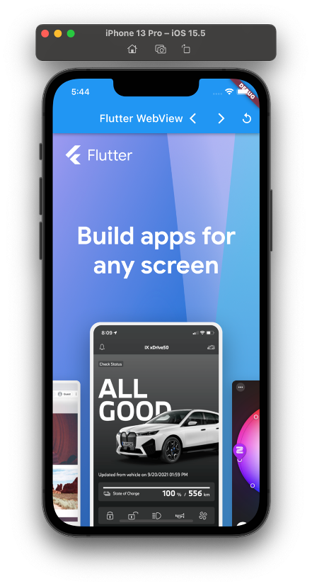

# Flutter Webview

## Langkah Praktikum 

### Getting Started

1. Membuat project baru

   `flutter create webview_in_flutter`

2. Menambahkan plugin pada dependency

   `flutter pub add webview_flutter`
   
### Menambahkan Widget Webview 

Pada langkah praktikum ini ditambahkan plugin `WebView` agar aplikasi dapat memuat halaman website. 

  

### Listening for page load events

Pada langkah praktikum ini menambahkan loading bar pada aplikasi, untuk mengetahuinya pada saat aplikaksi di load, maka akan muncul loading yang berbentuk garis lurus. 

### Accessing the WebViewController from the WebView Widget

Praktikum ini dilakukan akses WebViewController melalui widget Webview yang didalamnya terdapat beberapa control navigasi yang terletak pada AppBar.

 

### Keeping track of navigation with NavigationDelegate

NavigationDelegate digunakan untuk melakukan control navigasi yang terdapat pada webview, sebagai contoh ketika user melakukan klik pada sebuah link, maka NavigationDelegate dipanggil, ada beberapa perintah seperti `prevent` digunakan untuk melakukan blocking, dan `navigate` digunakan untuk melanjutkan navigasi. 

| <!-- -->                      | <!-- -->                     |
| -------------                 | -------------                |
|   |  |

### Evaluating Javascript

`WebViewController` dapat melakukan pengecekan pada Javascript expressions didalam konteks pada halaman terkini. Ada dua cara unutk melakukan evaluasi pada JavaScript, yang pertama `runJavaScript` jika terdapat return value dan `runJavaScriptReturningResult` jika tidak memiliki return value.  

| <!-- -->                      | <!-- -->                     |
| -------------                 | -------------                |
|   |  |

### Working With JavaScript Channel 

`JavaScriptChannel` digunakan untuk melakukan komunikasi dari kode JavaScript ke Flutter. Pada langkah praktikum ini dilakukan request ke Public IP Address API, dan me-return alamat IP Address perangkat. Hasilnya adalah menampilkan IP Address berupa `snackbar` dengan meng-invoke `postMessage` pada `snacbar` `JavaScriptChannel`.

| <!-- -->                      | <!-- -->                     |
| -------------                 | -------------                |
|   |  |

### Managing Cookies

Aplikasi flutter dapat melakukan manajemen cookies didalam `WebView` dengan menggunakan `CookieManager` class. Pada praktikum ini ada beberapa cookies yang akan digunakan, antara lain : 

1. Clear cookies

2. List cookies

3. Add cookies

4. Set cookies

5. Remove cookies

| <!-- -->                      | <!-- -->                     |
| -------------                 | -------------                |
|   |  |
|   |  |
|   |  |

### Load Flutter assets, files and HTML strings int the WebView

Berikut langkah-langkahnya 

1. Menambahkan plugin `path_provider` menggunakan perintah `flutter pub add path_provider`

2. Membuat direktori baru dengan nama `assets` pada folder root project.

3. Didalam direktori `assets` tambahkan file direktori `www`. 

4. Buat file `index.html` dan folder `styles` serta file `style.css` didalam folder tersebut. 

